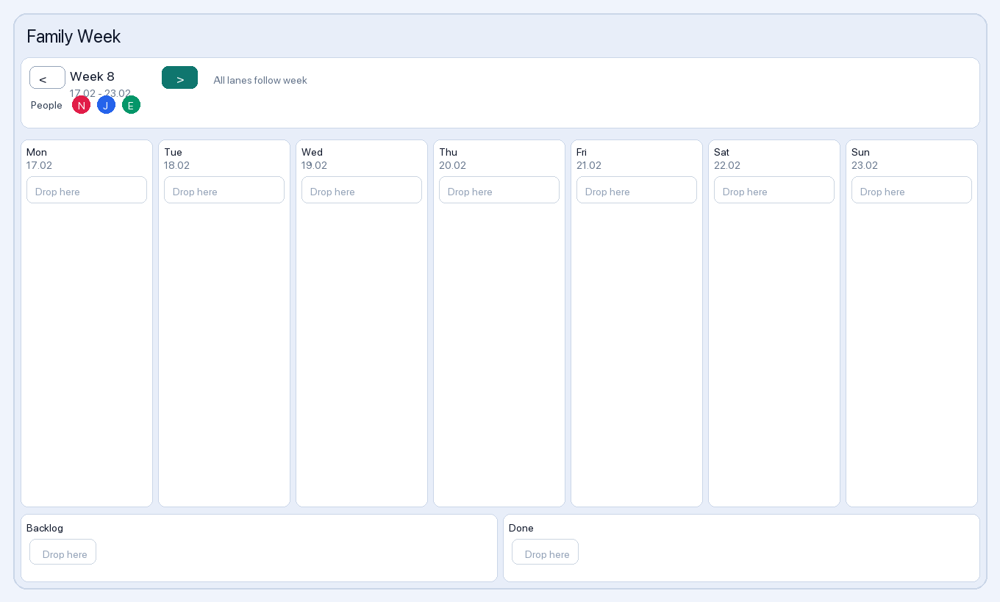
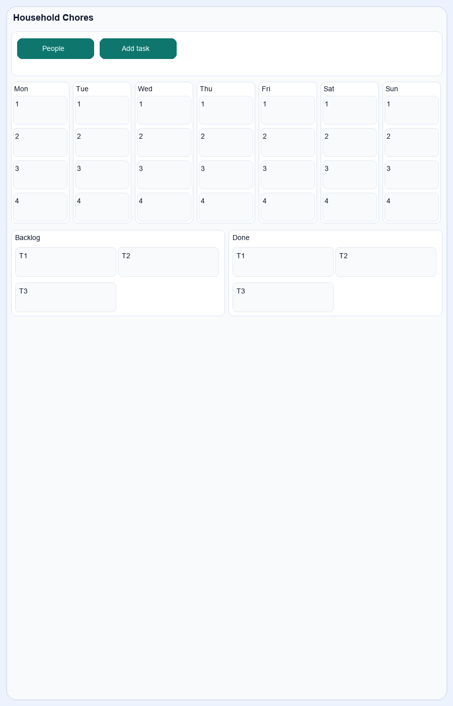
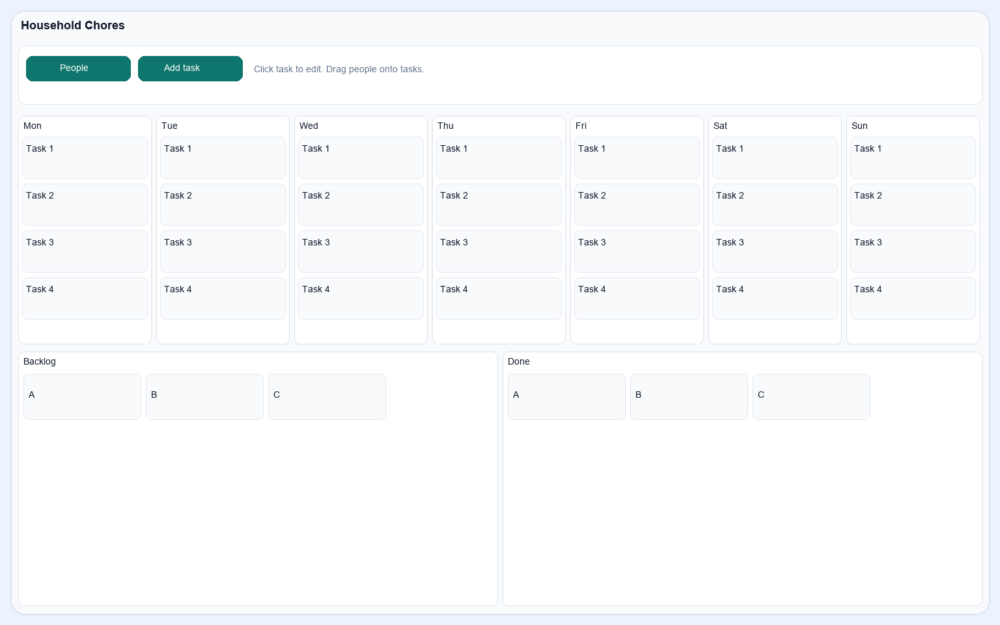

# homeassistant-household-chores

Household Chores is a HACS-installable custom integration for a weekly household task planner in Home Assistant.

## What you get

- Weekly board columns: Monday to Sunday
- Extra columns: Backlog and Done
- People with unique colored circular badges and first-letter initials
- Add people and tasks directly from the card
- Optional fixed recurring tasks with:
  - end date
  - weekday selection (`M T W T F S S`)
- Drag-and-drop tasks between backlog, weekdays, and done
- Persistent board data stored in Home Assistant (`.storage`)

## Install (HACS)

1. In Home Assistant, open HACS -> Integrations -> three dots -> Custom repositories.
2. Add this repository URL and select category `Integration`.
3. Install `Household Chores`.
4. Restart Home Assistant.
5. Go to Settings -> Devices & Services -> Add Integration -> `Household Chores`.

## Add the card

1. Open your dashboard and edit it.
2. Add a Manual card.
3. Use this config:

```yaml
type: custom:household-chores-card
title: Household Chores
```

If you have multiple `Household Chores` config entries, include `entry_id`:

```yaml
type: custom:household-chores-card
title: Family Week
entry_id: 0123456789abcdef0123456789abcdef
```

## Screenshots

### Tablet overview


### Compact/mobile layout


### Drag and drop between days


## Notes

- The custom card JavaScript is auto-registered by the integration at startup.
- Default chores/members entered during integration setup are used as starter board data.
- The card layout is optimized for tablet-sized dashboards (including iPad-width screens).
- Tasks moved to `Done` are automatically deleted nightly at `03:00` (Home Assistant local time).
- Weekly board refresh time is configurable in integration options (`day`, `hour`, `minute`).
- On weekly refresh:
  - tasks without an `end date` are removed
  - expired tasks are removed
  - fixed recurring tasks are rebuilt for the upcoming Monday-Sunday week (until their end date)
